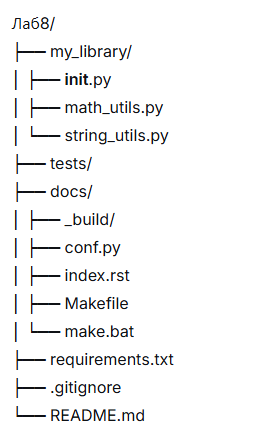
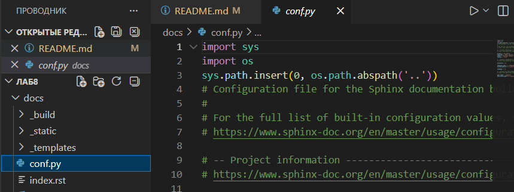
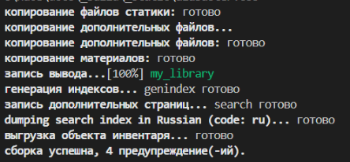
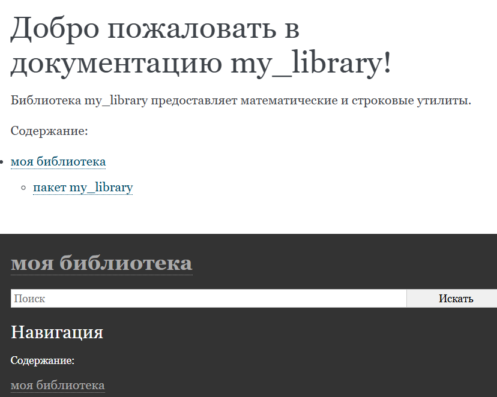
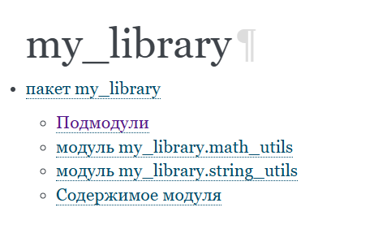
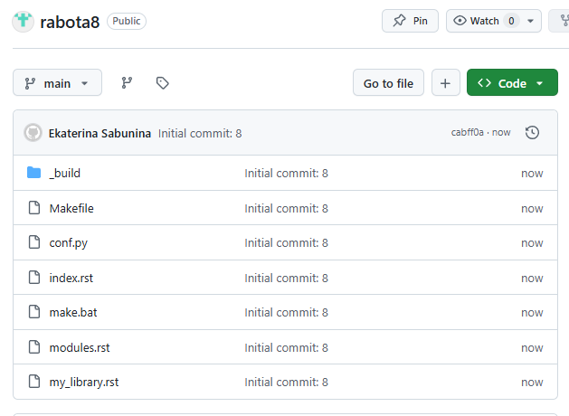

# Отчёт по лабораторной работе №8

**Дисциплина:** Разработка инструментального программного обеспечения  
**Тема:** Генерация документации с помощью Sphinx  
**Выполнила:** Екатерина Сабынина  
**Группа:** 222  

---
репозиторий: https://github.com/EkaterinaSabunina/rabota8

## 1. Цель работы

Освоить автоматическую генерацию технической документации для Python-библиотеки с использованием Sphinx. Получить навыки создания структурированной документации на основе docstrings.

---

## 2. Задачи работы

- Подготовить библиотеку с уже реализованными функциями
- Оформить docstrings в коде
- Установить Sphinx и настроить его для проекта
- Создать HTML-версию документации
- Проверить корректность сгенерированных материалов

---

## 3. Выполненные операции

### 3.1 Структура проекта

Документирование выполнялось для проекта из лабораторной работы №7. Библиотека `my_library` включает математические и строковые функции.



### 3.2 Подготовка кода (docstrings)

Перед генерацией документации в каждый модуль добавлены строки документации в формате Google Style.

**Пример для функции `calculate_mean`:**
```python
def calculate_mean(numbers):
    """
    Возвращает среднее арифметическое переданного списка чисел.

    Параметры:
        numbers (list of float): список числовых значений

    Возвращает:
        float: среднее арифметическое

    Исключения:
        ValueError: если список пуст

    Пример:
        >>> calculate_mean([1, 2, 3])
        2.0
    """
```

### 3.3 Установка Sphinx и подготовка окружения
Установка выполнена через pip:

```bash
py -m pip install sphinx
```
Затем в каталоге docs запущена инициализация:

```bash
cd docs
py -m sphinx.cmd.quickstart
```
В процессе заданы параметры:

разделение каталогов — нет

название проекта — my_library

автор — Ekaterina Sabunina

версия — 1.0.0

язык — русский (ru)

### 3.4 Настройка путей в conf.py
Для корректного импорта модулей в файл docs/conf.py добавлен путь к исходникам:

```python
import sys
import os
sys.path.insert(0, os.path.abspath('..'))
Скриншот содержимого conf.py: 
```
### 3.5 Автоматическое создание .rst-файлов
Из docstrings сгенерированы файлы описания модулей с помощью команды:

```bash
py -m sphinx.ext.apidoc -o . ../my_library
```
В результате получены:

```my_library.rst

modules.rst
```
### 3.6 Редактирование index.rst
Файл docs/index.rst модифицирован для включения сгенерированного содержания:

```rst
Документация my_library
========================

Библиотека предоставляет набор утилит для работы с числами и строками.

.. toctree::
   :maxdepth: 2
   :caption: Содержание:

   modules
   ```
### 3.7 Генерация HTML
HTML-документация собрана командой:

```bash
py -m sphinx.cmd.build . ./_build
```
Скриншот сборки: 

### 3.8 Результат
Готовая документация находится в docs/_build/index.html. Она включает:

общее описание библиотеки

перечень модулей с навигацией

описание всех функций с параметрами и примерами

Скриншот главной страницы документации: 

Скриншот страницы с описанием функции: 

репозиторий: https://github.com/EkaterinaSabunina/rabota8


## 4. Выводы
Зачем нужна документация
помогает другим разработчикам понять назначение и использование кода

уменьшает количество возникающих вопросов и ошибок

является обязательной частью профессиональной разработки

Преимущества автоматической генерации
документация всегда соответствует текущему состоянию кода

все модули оформлены в едином стиле

процесс не требует ручного копирования и форматирования

возможен экспорт в HTML, PDF и другие форматы

Почему выбран Sphinx
стандартный инструмент для Python-проектов

умеет извлекать информацию из docstrings

создаёт удобную HTML-структуру с поиском и навигацией

используется в крупных проектах (Python, Django, NumPy)

поддерживает темы оформления и плагины

## 5. Заключение
Лабораторная работа выполнена полностью. В код добавлены docstrings, настроен Sphinx, сгенерирована HTML-документация с навигацией по модулям и функциям. Полученные навыки могут применяться для документирования любых Python-проектов.

https://image-5.png
